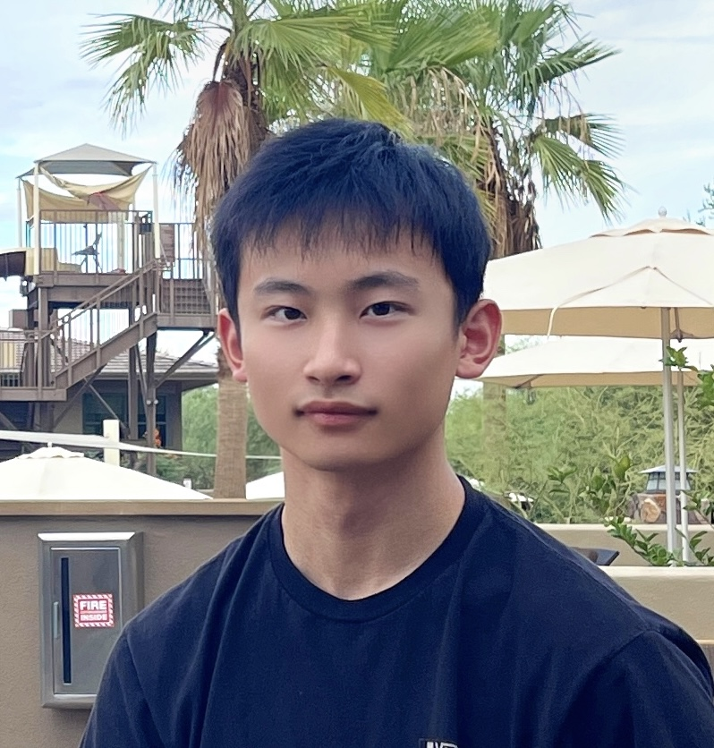

# Boyu Tian
### I'm a *sophomore student* majoring in `Computer Science`

This is my favorite professor: [Thomas A. Powell](https://cse.ucsd.edu/people/faculty-profiles/thomas-powell)
> Software Engineering is not just about coding, but also involves team building, communication, and cooperation.

This is the [README](README.md) file

Here are the classes I take this quarter:
1. CSE101
2. CSE105
3. CSE110
4. MATH180C

Here are my hobbies:
- soccer
- basketball
- traveling
- surfing

Here are some tasks:
- [x] task1
- [x] task2
- [ ] task3

[Go back to top](#boyu-tian)